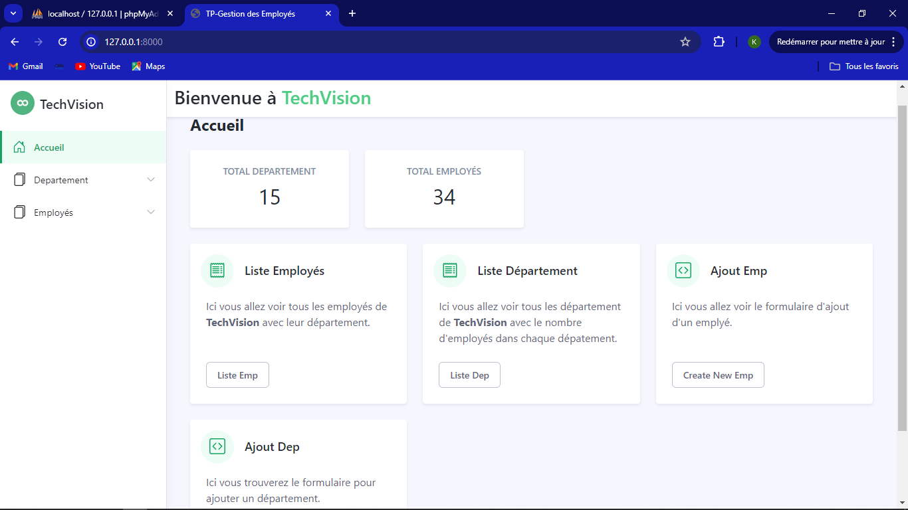
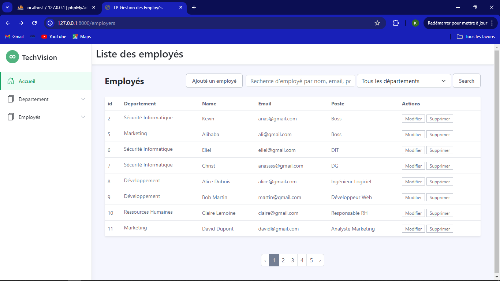
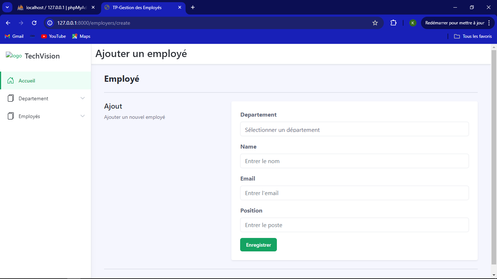
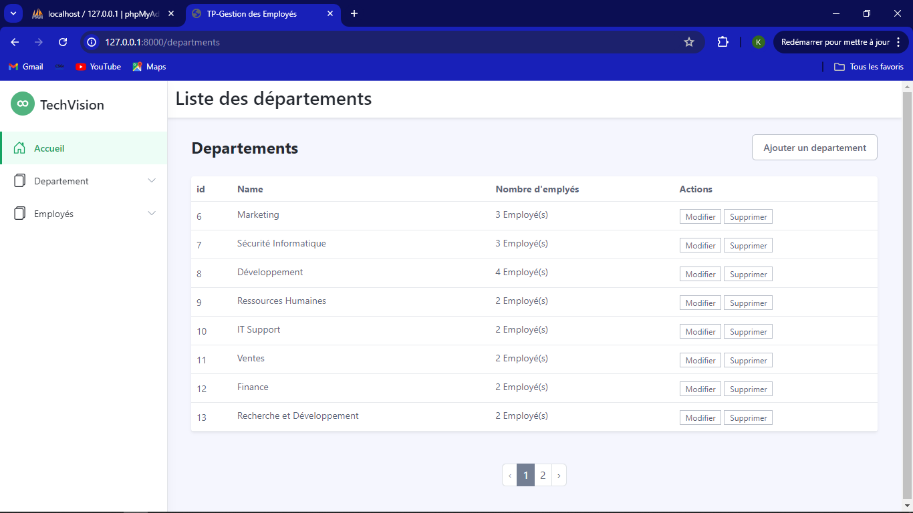
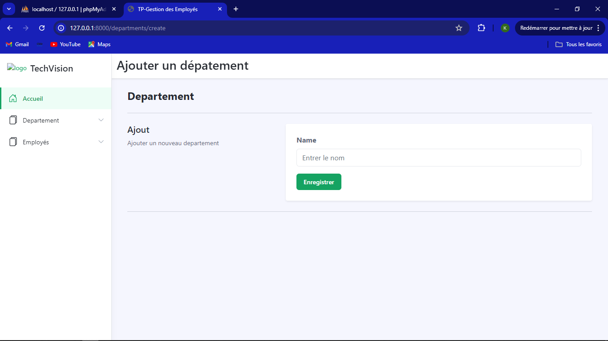

# Gestion des Employés et des Départements

## Titre du TP :
Système de gestion d'employés

## Capture d’écran des interfaces

### Accueil

### Liste des employés

### Formulaire de création d'un employé

### Liste des départements

### Formulaire de création d'un département

